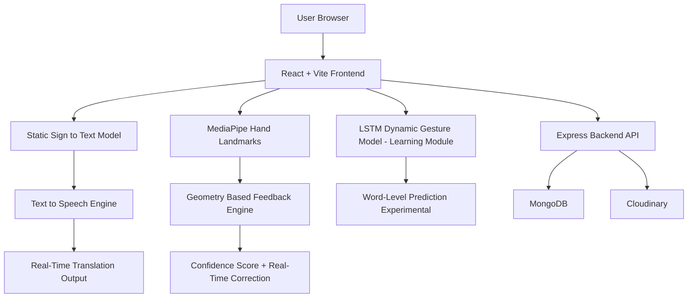

<h1 align="center">
  <a href="https://github.com/yourusername/signspeak">
    SignSpeak
  </a>
  <br>
  Learn • Practice • Translate Sign Language in Real Time
</h1>

<div align="center">
  <strong>Breaking Communication Barriers with AI</strong>
</div>

<hr>

<details>
<summary>Table of Contents</summary>

- [Description](#description)
- [Links](#links)
- [Tech Stack](#tech-stack)
- [Progress](#progress)
- [Future Scope](#future-scope)
- [Applications](#applications)
- [Project Setup](#project-setup)
- [Team Members](#team-members)
- [Mentors](#mentors)

</details>

## 📝 Description

**SignSpeak** is an interactive, full-stack web platform that makes learning and using sign language accessible to everyone. It combines **real-time gesture recognition**, **structured learning courses**, and **AI-powered feedback** to help users master ASL (American Sign Language) and eventually ISL.

Users can:
- Learn through structured video + image courses
- Practice with live camera feedback
- Translate signs in real-time (text + speech)
- Track progress and earn achievements

Built with a modern tech stack and focused on accessibility and inclusivity.

## 🔗 Links

- **GitHub Repository**: [github.com/annuuxoxo/SignSpeak_Inheritance](https://github.com/annuuxoxo/SignSpeak_Inheritance)
- **Demo Video & Project Presentation**: [Link](https://drive.google.com/drive/folders/1y45y-E0XNwGGIpcIZisVOcAcBqTbmHao?usp=sharing)

## 🤖 Tech Stack

### 🏗️ System Architecture

## Frontend

* React 18 + Vite
* Tailwind CSS + Radix UI components
* React Webcam + MediaPipe Tasks Vision
* TensorFlow.js (for browser inference)

## Backend

* Node.js + Express
* MongoDB + Mongoose
* JWT Authentication
* Passport.js (Google + GitHub OAuth)
* Cloudinary (video/image hosting)
* Multer (file uploads)

## AI/ML

* MediaPipe Hand Landmarker (real-time hand tracking)
* Custom LSTM Model (TensorFlow/Keras) for common words
* Rule-based letter recognition with angle & distance analysis
* Python microservices (separate servers for models)

## Other Tools

Nodemon, dotenv, concurrently

## 📈 Progress
Fully Implemented Features

1. User Authentication — Local + Google + GitHub OAuth
2. Course System — Structured learning with sections & lectures (video + image)
3. Real-time Translation — Live camera → text + speech using MediaPipe
4. Practice Mode — Real-time feedback for finger spelling (e.g., Letter F)
5. Progress Tracking — Enrollment, completion status, last watched lecture
6. Admin Dashboard — Upload courses, videos, and images
7. Review System — Users can rate and comment
8. Responsive UI — Modern, accessible design with dark mode

Partially Implemented / Work in Progress

- Common Words Model — LSTM model ready (server running on port 5003)
- Advanced Practice Analytics — Basic stats only so far

## 🔮 Future Scope

- Full Indian Sign Language (ISL) support
- Multi-language translation (English → ASL/ISL → Speech)
- Mobile App (React Native)
- Community Features — Video calls with sign language interpretation
- Gamification — Badges, streaks, leaderboards
- Offline Mode using IndexedDB + cached models

## 💸 Applications

1. Education — Schools, colleges, and self-learners
2. Healthcare — Better communication between doctors and deaf patients
3. Corporate — Inclusive workplaces and customer support
4. Family — Helping hearing families learn to communicate with deaf members
5. Accessibility Tools — Real-time translation for public spaces

## 🛠 Project Setup

Prerequisites

Node.js 18+
Python 3.11
MongoDB
Cloudinary account

### Run the Project
Open 3 terminals:
1. Frontend
```
cd frontend
npm install
npm run dev
```
2. Backend API
```
cd backend
npm install
npm run dev
```
3. Common Words AI Model
```
# At project root
py -3.11 -m venv venv311
.\venv311\Scripts\activate
pip install numpy tensorflow
python backend/ai/common_words_server.py
```
Access the app: http://localhost:3000
## Team Members

### 🌸 Anushree Upasham  
**Role:** Frontend Developer & AI Models  
**GitHub:** [@annuuxoxo](https://github.com/annuuxoxo)

---

### 🌸 Sakshi Kalunge  
**Role:** ML • MediaPipe • Computer Vision  
**GitHub:** [@SakshiKalunge07](https://github.com/SakshiKalunge07)

---

### 🌸 Shreya Mane  
**Role:** Backend Developer  
**GitHub:** [@shreyamane1526](https://github.com/shreyamane1526)

---

### 🌸 Sofia Abidi  
**Role:** Backend Developer  
**GitHub:** [@sofiaabidi](https://github.com/sofiaabidi)

---

## 🌟 Mentors

A huge shoutout for their constant support and guidance:

- **Niharika Hariharan** [@niharika](https://github.com/23f2003701-1)
- **Sourish Phate** [@sourishphate](https://github.com/sourishphate)

